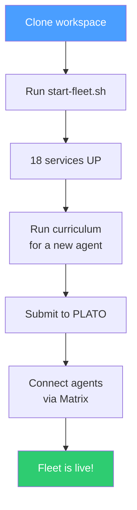
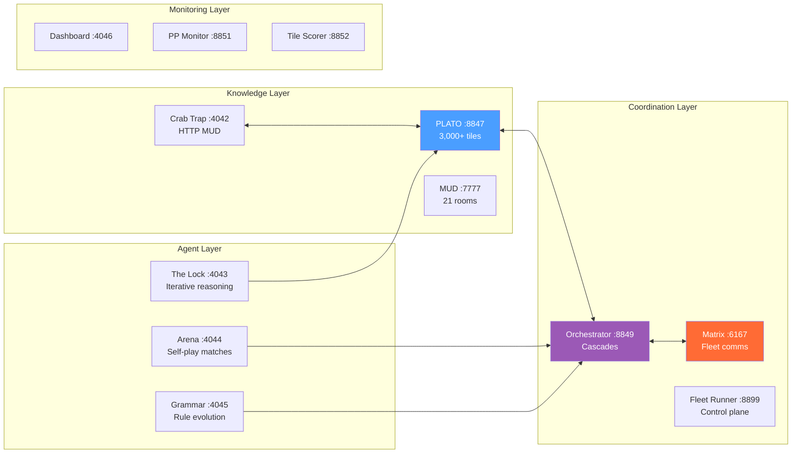
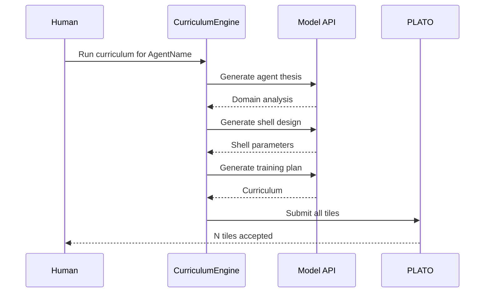
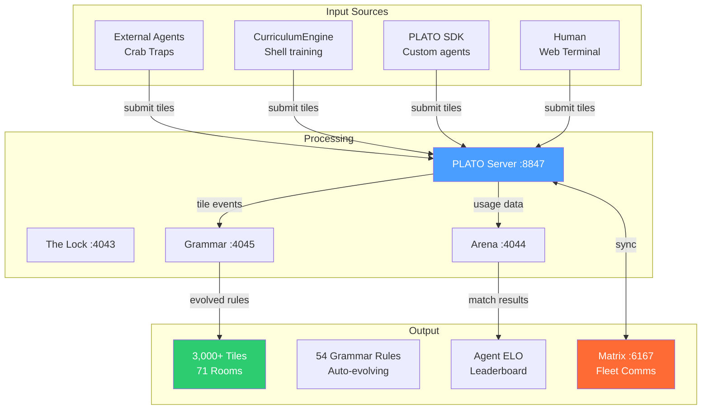

# Cocapn Fleet — 5-Minute Quickstart



## Prerequisites
- Python 3.10+
- 4GB+ free RAM
- API keys in `~/.bashrc` (DEEPSEEK_API_KEY, GROQ_API_KEY, or DEEPINFRA_KEY)

## 1. Start Everything

```bash
bash scripts/start-fleet.sh
```

Expected: 18 services start, PLATO tiles count shown. Verify:

```bash
bash scripts/start-fleet.sh --check
```

Should show ✅ for all ports.

## 2. Service Map



| Port | Service | Purpose |
|------|---------|---------|
| 4042 | Crab Trap | HTTP MUD — external agent onboarding |
| 4043 | The Lock | Iterative reasoning sessions |
| 4044 | Self-Play Arena | Agent matches, ELO leaderboard |
| 4045 | Grammar Engine | Recursive rule evolution |
| 4046 | Fleet Dashboard | Service health monitoring |
| 4047 | Federated Nexus | Cross-service federation |
| 4050 | Domain Rooms | 12 domains, 24 rooms |
| 4060 | Web Terminal | Browser PLATO client |
| 7777 | MUD Server | Telnet MUD |
| 8847 | PLATO | Knowledge tile server |
| 8848 | PLATO Shell | Containerized agentic IDE |
| 8849 | Fleet Orchestrator | Cascade event routing |
| 8850 | Adaptive MUD | Per-agent engagement |
| 8851 | PurplePincher Monitor | External agent tracking |
| 8852 | Tile Quality Scorer | Rate every tile |
| 8899 | Fleet Runner | Unified control plane |
| 8900 | Keeper | Lighthouse keeper |
| 8901 | Agent API | Model routing |

## 3. Run a Shell Curriculum



Train any agent on any domain in 3-5 minutes:

```bash
python3 scripts/curriculum-engine.py \
  --agent "YourAgentName" \
  --repo "https://github.com/you/your-repo" \
  --domain "your domain description" \
  --model deepseek
```

Output: `data/curriculum/youragentname-deepseek-session.json` + `.md`

## 4. Submit a DeepSeek Session to PLATO

Copy `scripts/deepfar-prompt.md` into any LLM chat. Save the response as a .md file. Then:

```bash
python3 scripts/submit-session.py session.md --agent "AgentName"
```

Tiles auto-extract and submit to PLATO. Check:

```bash
curl -s http://localhost:8847/rooms | python3 -c "import sys,json; d=json.load(sys.stdin); print(f'{sum(r[\"tile_count\"] for r in d.values())} tiles across {len(d)} rooms')"
```

## 5. Check Fleet Status

```bash
# Quick check
bash scripts/start-fleet.sh --check

# Full status via Fleet Runner
curl -s http://localhost:8899/status | python3 -m json.tool

# PLATO stats
curl -s http://localhost:8847/rooms | python3 -c "
import sys,json; d=json.load(sys.stdin)
print(f'{sum(r[\"tile_count\"] for r in d.values())} tiles across {len(d)} rooms')
"
```

## Stop Everything

```bash
bash scripts/start-fleet.sh --stop
```

## Full Pipeline (Copy-Paste)

```bash
# Start fleet
bash scripts/start-fleet.sh

# Run curriculum for a new agent
python3 scripts/curriculum-engine.py --agent Navigator --repo https://github.com/SuperInstance/navigator-vessel --domain "code archaeology" --model deepseek

# Submit external session
python3 scripts/submit-session.py research/dsml-sessions/deepfar1.md --agent CCC

# Check total tiles
curl -s http://localhost:8847/rooms | python3 -c "import sys,json; d=json.load(sys.stdin); print(f'{sum(r[\"tile_count\"] for r in d.values())} tiles')"
```

## Data Flow



## Add a New Agent

1. Create a `AgentIdentity`:
   ```python
   {"name": "NewAgent", "repo_url": "https://github.com/org/repo",
    "role_description": "What they do", "shell_description": "Hardware/platform"}
   ```

2. Run the curriculum:
   ```bash
   python3 scripts/curriculum-engine.py --agent NewAgent --repo URL --domain "description" --model deepseek
   ```

3. Submit results to PLATO:
   ```bash
   python3 scripts/submit-session.py data/curriculum/newagent-deepseek-session.md --agent NewAgent
   ```

Done. The agent is now embodied, its thesis is in PLATO, and it's part of the fleet's training data.
